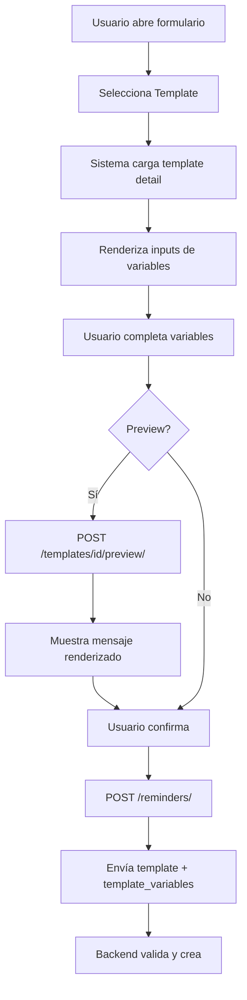
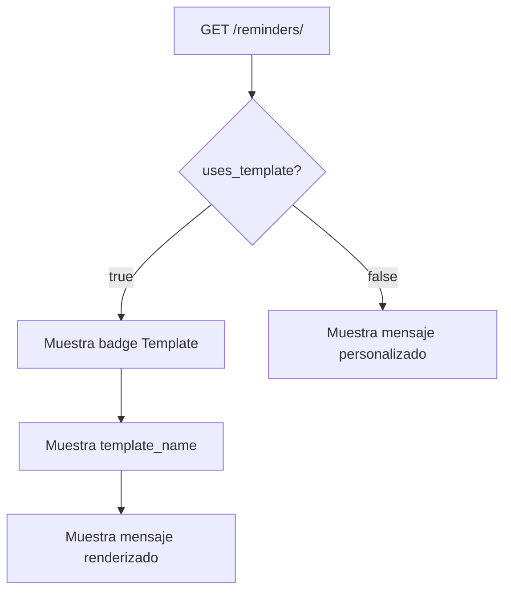

# 📱 WhatsApp Templates - Implementación Frontend

## 🎯 Resumen

Se implementó soporte completo para WhatsApp Templates en el sistema de recordatorios de AgendyFix. Los usuarios ahora pueden crear recordatorios usando templates aprobados por WhatsApp en lugar de mensajes de texto libre, cumpliendo con los requisitos de WhatsApp Business API.

---

## 📦 Archivos Creados

### 1. **Types & Models**

#### `lib/types/models.ts`
- ✅ `TemplateCategoryType`: Tipos de categorías de templates
- ✅ `TemplateStatus`: Estados de aprobación (pending, approved, rejected)
- ✅ `TemplateVariableMetadata`: Metadata de variables del template
- ✅ `WhatsAppTemplate`: Modelo completo de template
- ✅ `TemplateCategoryOption`: Opciones de categorías para filtros

**Campos agregados al modelo `Reminder`:**
```typescript
template: string | null;              // UUID del template
template_name: string | null;         // Nombre del template
template_variables: Record<string, string> | null; // Variables
uses_template: boolean;               // Indica si usa template
message: string;                      // Mensaje (vacío si usa template)
final_message: string | null;         // Mensaje renderizado (detail)
```

#### `lib/types/api.ts`
- ✅ `TemplateListParams`: Parámetros para listar templates
- ✅ `TemplatePreviewRequest`: Request para preview
- ✅ `TemplatePreviewResponse`: Response del preview

**Actualización de `CreateReminderRequest`:**
```typescript
// Ahora soporta template O message (XOR)
template?: string;
template_variables?: Record<string, string>;
message?: string;
```

### 2. **API Client**

#### `lib/api/templates.ts` (NUEVO)
```typescript
export const templatesApi = {
  getAll: getTemplates,           // GET /templates/
  getById: getTemplateById,       // GET /templates/{id}/
  preview: previewTemplate,       // POST /templates/{id}/preview/
  getCategories: getTemplateCategories, // GET /templates/categories/
};
```

### 3. **Hooks**

#### `lib/hooks/useTemplates.ts` (NUEVO)
```typescript
// Hook para listar templates
export const useTemplates = () => {
  // fetchTemplates, templates, isLoading, pagination...
};

// Hook para template individual
export const useTemplate = (id: string) => {
  // fetchTemplate, template, isLoading
};

// Hook para preview
export const useTemplatePreview = () => {
  // generatePreview, clearPreview, preview, isLoading
};

// Hook para categorías
export const useTemplateCategories = () => {
  // fetchCategories, categories, isLoading
};
```

### 4. **Components**

#### `components/reminders/ReminderForm.tsx` (ACTUALIZADO)
**Nuevas características:**
- ✅ Radio buttons para seleccionar modo: "Template" o "Mensaje Personalizado"
- ✅ Selector de templates (solo muestra aprobados)
- ✅ Inputs dinámicos para variables del template
- ✅ Botón "Vista Previa" con modal
- ✅ Validación de variables completas
- ✅ Envío correcto de `template` + `template_variables` O `message`

**Flujo de uso:**
1. Usuario selecciona "Template de WhatsApp"
2. Elige un template del dropdown
3. Completa las variables requeridas
4. (Opcional) Ve preview del mensaje
5. Crea el recordatorio

#### `components/reminders/ReminderCard.tsx` (ACTUALIZADO)
**Cambios:**
- ✅ Detecta si el reminder usa template (`uses_template`)
- ✅ Muestra badge "📋 Template:" con el nombre
- ✅ Muestra el mensaje renderizado si está disponible

---

## 🔄 Flujo de Trabajo

### Crear Recordatorio con Template



### Visualizar Recordatorio



---

## 📋 Endpoints Utilizados

### 1. Listar Templates
```http
GET /api/v1/templates/?status=approved
```
**Response:**
```json
{
  "count": 3,
  "results": [
    {
      "id": "uuid",
      "name": "ibits_academy_class_reminder_v1",
      "display_name": "Recordatorio de Clase - Ibits Academy",
      "variable_count": 7,
      "variable_names": ["tema", "profesor", "hora", ...],
      "is_approved": true
    }
  ]
}
```

### 2. Detalle de Template
```http
GET /api/v1/templates/{id}/
```
**Response:**
```json
{
  "id": "uuid",
  "body": "Tema: {{1}}\nProfesor: {{2}}...",
  "variables_metadata": {
    "1": {
      "name": "tema",
      "description": "Tema de la clase",
      "example": "Python Avanzado"
    }
  }
}
```

### 3. Preview
```http
POST /api/v1/templates/{id}/preview/
Body: {"variables": {"1": "Python", "2": "Ing. Carlos"}}
```
**Response:**
```json
{
  "rendered_message": "Tema: Python\nProfesor: Ing. Carlos..."
}
```

### 4. Crear Reminder con Template
```http
POST /api/v1/reminders/
```
**Body:**
```json
{
  "channel": "whatsapp",
  "reminder_type": "custom",
  "client_group": "group-uuid",
  "template": "template-uuid",
  "template_variables": {
    "1": "Python Avanzado",
    "2": "Ing. Carlos Méndez",
    "3": "10:00 AM"
  },
  "scheduled_at": "2026-01-25T10:00:00-06:00",
  "recurrence": "weekly"
}
```

---

## ✅ Validaciones Implementadas

### Frontend
1. ✅ **XOR Template/Message**: Solo uno puede estar presente
2. ✅ **Variables completas**: Todas las variables del template deben tener valor
3. ✅ **Template aprobado**: Solo se muestran templates con `is_approved: true`
4. ✅ **Destinatario requerido**: Cliente o grupo debe estar seleccionado

### Backend (esperado)
1. ✅ Validar que template existe y está aprobado
2. ✅ Validar que todas las variables requeridas están presentes
3. ✅ Validar que template pertenece a la compañía
4. ✅ Renderizar mensaje antes de enviar

---

## 🎨 UI/UX

### Formulario de Creación
```
┌─────────────────────────────────────────┐
│ Modo de Mensaje                         │
│ ⚫ Template de WhatsApp                 │
│ ⚪ Mensaje Personalizado                │
│                                         │
│ Seleccionar Template                    │
│ ┌─────────────────────────────────────┐ │
│ │ 📋 Recordatorio de Clase - Ibits    │ │
│ └─────────────────────────────────────┘ │
│                                         │
│ Variables del Template                  │
│ ┌─────────────────────────────────────┐ │
│ │ Tema de la clase                    │ │
│ │ [Python Avanzado - Módulo 3]        │ │
│ │                                     │ │
│ │ Nombre del profesor                 │ │
│ │ [Ing. Carlos Méndez]                │ │
│ │                                     │ │
│ │ [👁️ Vista Previa]                   │ │
│ └─────────────────────────────────────┘ │
│                                         │
│ [✅ Crear Recordatorio]                 │
└─────────────────────────────────────────┘
```

### Tarjeta de Reminder
```
┌─────────────────────────────────────────┐
│ 📅 25 ene 2026, 10:00    [✓ Enviado]   │
│                                         │
│ 📱 👥 Grupo: Alumnos Python             │
│                                         │
│ 💬 📋 Template: Recordatorio de Clase   │
│    Tema: Python Avanzado - Módulo 3    │
│    Profesor: Ing. Carlos Méndez...     │
│                                         │
│ 🔁 Semanal - Lunes a las 10:00         │
└─────────────────────────────────────────┘
```

---

## 🔮 Consideraciones Futuras

### Fase 2 (Opcional)
- [ ] Guardar variables como "favoritos" para reutilizar
- [ ] Autocompletar variables comunes (nombre de cliente, etc.)
- [ ] Filtrar templates por categoría en el selector
- [ ] Búsqueda de templates
- [ ] Mostrar estadísticas de uso de templates

### Fase 3 (Avanzado)
- [ ] Editor visual de templates (solo superadmin)
- [ ] Historial de cambios en templates
- [ ] A/B testing de templates
- [ ] Analytics de efectividad por template

---

## 🐛 Troubleshooting

### Error: "Debe proporcionar template o message"
**Causa:** Se envió ambos o ninguno
**Solución:** Asegurar que solo uno esté presente en el request

### Error: "Faltan variables requeridas"
**Causa:** No se completaron todas las variables del template
**Solución:** Validar en frontend que todos los inputs tengan valor

### Error: "Template no está aprobado"
**Causa:** Se intentó usar un template pending/rejected
**Solución:** Filtrar templates con `status=approved` en el fetch

### Templates no aparecen en el selector
**Causa:** No hay templates aprobados para la compañía
**Solución:** Superadmin debe aprobar templates en Django Admin

---

## 📊 Testing

### Casos de Prueba

1. **✅ Crear reminder con template**
   - Seleccionar template
   - Completar variables
   - Ver preview
   - Crear recordatorio
   - Verificar en historial

2. **✅ Crear reminder sin template (mensaje personalizado)**
   - Seleccionar "Mensaje Personalizado"
   - Escribir mensaje
   - Crear recordatorio
   - Verificar que no tiene template

3. **✅ Preview de template**
   - Seleccionar template
   - Completar variables
   - Click en "Vista Previa"
   - Verificar mensaje renderizado

4. **✅ Validación de variables**
   - Seleccionar template
   - Dejar variables vacías
   - Intentar crear
   - Verificar error de validación

5. **✅ Visualización en tarjetas**
   - Crear reminder con template
   - Ver en lista de programados
   - Verificar badge de template
   - Ver en historial después de enviar

---

## 📝 Notas Importantes

1. **WhatsApp Business API Requirement**: Los templates son REQUERIDOS por WhatsApp para iniciar conversaciones. No se pueden enviar mensajes de texto libre a usuarios que no han iniciado conversación en las últimas 24 horas.

2. **Aprobación de Templates**: Solo superadmin puede aprobar templates en Django Admin. Los templates deben estar aprobados por WhatsApp antes de poder usarse.

3. **Variables Dinámicas**: Las variables se numeran como `{{1}}`, `{{2}}`, etc. en el template, pero se mapean a nombres descriptivos en `variables_metadata`.

4. **Compatibilidad**: Los reminders antiguos (sin template) siguen funcionando normalmente. El campo `message` sigue disponible para mensajes personalizados.

5. **Recurrencia**: Los templates funcionan perfectamente con recordatorios recurrentes. Las mismas variables se usan en cada instancia.

---

## 🎓 Recursos

- **Documentación Backend**: `docs/whatsapp-templates-guide.md`
- **Resumen para Frontend**: `docs/whatsapp-templates-frontend-summary.md`
- **WhatsApp Business API**: https://developers.facebook.com/docs/whatsapp/business-management-api/message-templates

---

**Implementado por:** Kilo Code  
**Fecha:** 28 de enero de 2026  
**Versión:** 1.0.0